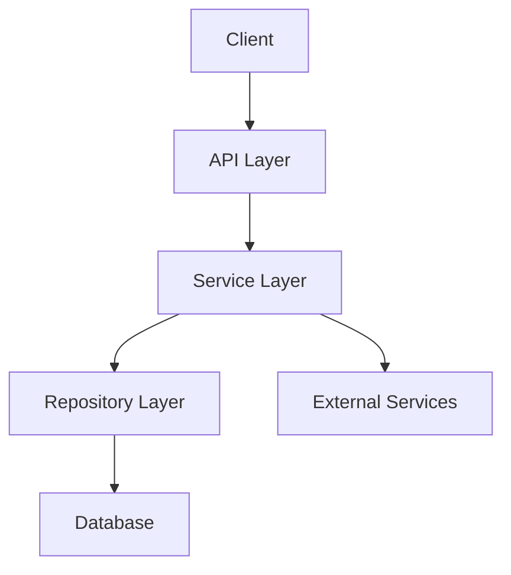

# System Patterns

[2025-03-23 22:58:47] - Initial Architecture Documentation

## Code Standards
- Python-based development
- Type hints for better code clarity
- SQLAlchemy for database operations
- Alembic for database migrations
- RESTful API design principles

## Design Patterns
### Application Structure
- Model-View-Controller (MVC) pattern
- Repository pattern for data access
- Factory pattern for database sessions
- Dependency injection for services

### Database
- SQLAlchemy ORM for database interactions
- Migration-based schema management
- Base class pattern for models

### API Design
- RESTful endpoints
- JSON response format
- Proper error handling and status codes
- API versioning preparation

## Architecture Patterns
### Component Organization
```
app/
├── models/      # Database models
├── services/    # Business logic
├── api/         # API endpoints
└── utils/       # Helper functions
```

### Data Flow


## Best Practices
- Clean code principles
- Comprehensive documentation
- Test-driven development
- Code review process
- Regular refactoring
- Security considerations